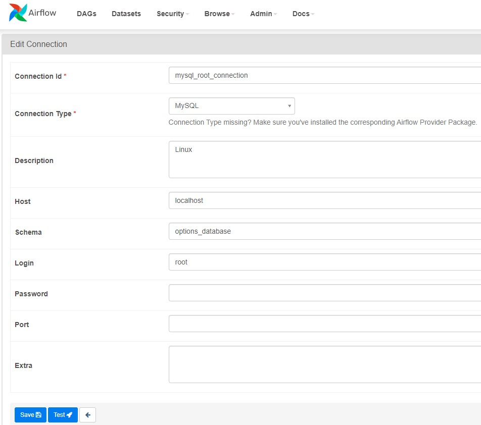
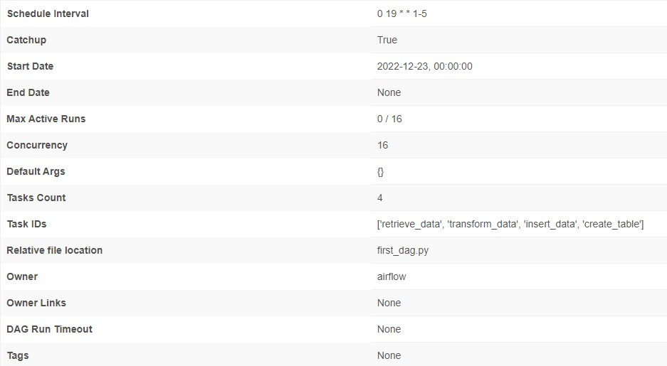
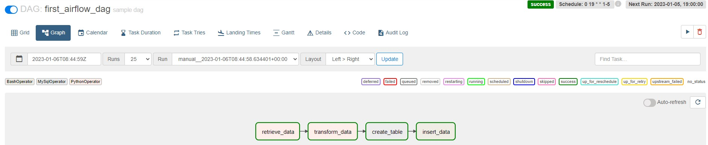
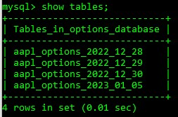
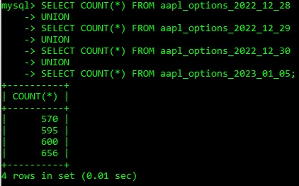

# Data Miner
This project will use Apache Airflow to create a workflow that collects data using API and storing it our local machine and in SQL database.

# Dag description
- Create the DAG and schedule it to run Mon ~ Friday UTC timezone at 19:00

- Create a python task which will run our **retrieve_data.py**.
    - **retrieve_data.py** will use TD_Ameritrade API to retrieve and store raw price and option data in json format.
    
    
- Create a python task which will run our **transform_data.py**.
    - **transform_data.py** will transform the data in json file that was retrieved from **retrieve_data.py** and save the transformed data into csv file.
    

- Create a sql task that connects to our sql database and create a table that will store the csv file data.

- Create a bash task that will run our **insert_data.sh** shell script.
    - **insert_data.sh** will start mysql server and database in my local machine and insert data into the created table
    
- Lastly, create a task pipeline for airflow to run tasks in order.

# Apache Airflow
- Apache Airflow webserver is a UI to get an overview of our DAGs.
- Apache Airflow scheduler is used to monitor all tasks and DAGS.

In order to use Airflow webserver and scheduler, Apache airflow packages must be downloaded and I have downloaded all neccessary airflow packages in Linux Ubuntu.

After starting Airflow webserver and scheduler, I have created a connection_id to my SQLdatabase which will be used for my sql task.

#

After finishing writing our DAG tasks and pipeline, I can check the DAG description and test run my DAG in Airflow webserver

#
#

Double checking if my final processes of inserting data has been successfully accomplished by looking into our sql database

#
#
